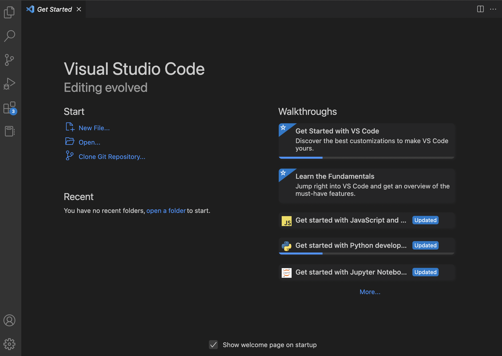
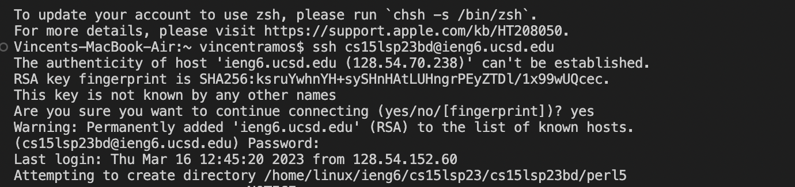
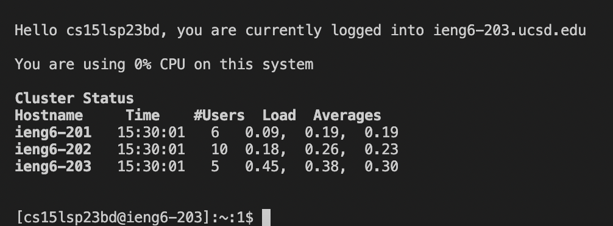
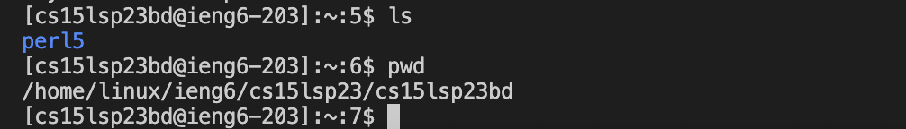
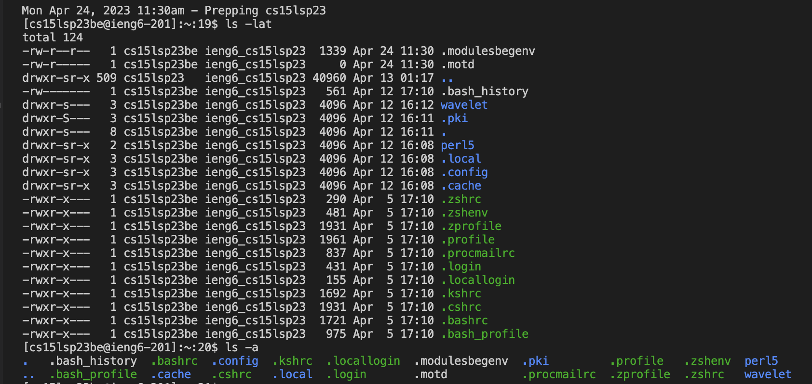
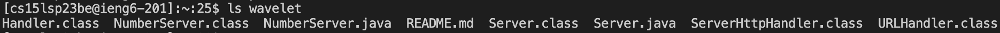
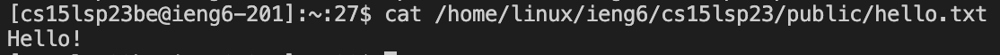

# Lab Report 1
Let's start with resetting your account password!
Follow the guide to resetting your account password here: [Link](https://docs.google.com/document/d/1hs7CyQeh-MdUfM9uv99i8tqfneos6Y8bDU0uhn1wqho/edit)

Let's continue by downloading visual studio!
Go to this link [Link](https://code.visualstudio.com/) and follow the steps to download the correct vscode for your device.

After opening vscode, it should look like this:


Create a text file and open up a new terminal. A new terminal can be opened through the terminal tab. In this terminal, type the command  
```$ ssh cs15lsp23zz@ieng6.ucsd.edu```  with the "zz" in the command replaced by the letters in your course specific account (Do not include the "$"!)

An example of the command being used can be seen here:

After the command is used, a prompt will appear as seen in the image above, type yes and press enter. You will then be asked to enter a password which can also be seen in the image (Be careful when entering your password because you can't see the characters you type, make sure you enter it correctly!)

After entering your password, you should be greated with the following message:


Now your terminal is remotely connected to a CSE basement computer!

Try running the commands ```cd```, ```ls```, ```pwd```, ```mkdir```, and ```cp```. Here is an example of some of these commands and others:



The commands used in the image above expand on the directories shown from using the simple ```ls``` comand


The command in the image lists files or directories


The command above will read and write the output of a file, depending on the specific directory you lead it to. In this case, it is outputting the contents of a file named "hello.txt"

If you wish to exit the remote server, use the command ```exit``` or press ```Ctrl + D```
