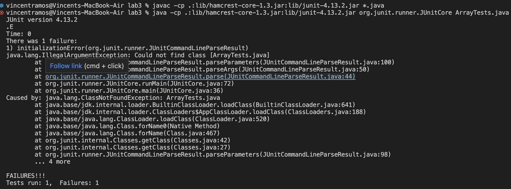
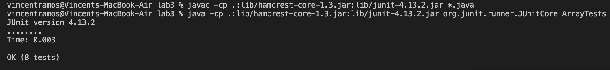

***TA:*** Before we begin, please answer the following questions so I can efficiently help you:

What environment are you using (computer, operating system, web browser, terminal/editor, and so on)?

Detail the symptom you're seeing. Be specific; include both what you're seeing and what you expected to see instead. Screenshots are great, copy-pasted terminal output is also great. Avoid saying “it doesn't work”.

Detail the failure-inducing input and context. That might mean any or all of the command you're running, a test case, command-line arguments, working directory, even the last few commands you ran. Do your best to provide as much context as you can.

***Student:*** I'm using visual studio code on an imac, and running the commands through a "zsh" terminal. I tried to run tests and it says one of them failed. I am not sure what part of my code is the issue. It could be an error in my code or in the commands used.

***TA:*** Let's start by looking at the commands you used, commands are a common issue and can result in a quick fix.

***Student:*** Here you go:

***TA:*** I believe the problem here is that you called ArrayTests with ".java" at the end in the java command. That would only be necessary if you were using the javac command. Go ahead and try this again, but remove .java from that java command. 

***Student:*** It works! Here is the result:

***TA:*** Glad to hear that it works! Let me know if you have any other issues, and next time please make sure to take a closer look at your commands as that is a simple mistake that could be fixed.

# Reflection

This entire course has been an interesting experience when it came to learning to use terminals and other things that we use during our labs. I would say the best thing to learn from the second half of the course was writing bash scripts. I think that they are very convenient and can save people a lot of time, I know that I definetly saved time whenever I used them. 
